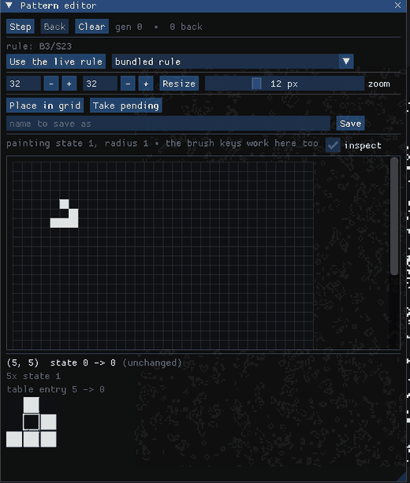

> **Status:** Current for 2026-09-23
> **Audience:** people using Aether — running it, authoring rules, recording what it does. No prior cellular-automata background assumed; no C++ needed.
> **See also:** [README](README.md) for the short version, [BUILD.md](BUILD.md) for prerequisites, [SPEC.md](SPEC.md) when you need the exact rules rather than the working ones.

# The Aether manual

Aether runs cellular automata on a GPU. One engine covers one, two and three dimensions, square and hexagonal lattices, discrete states and continuous values; rules are written in a small notation or in Lua; and every run can be saved and replayed to the identical cell.

This manual is in three parts. **Getting started** is enough to see something moving. **The window** walks through each section of the interface. **Working with it** covers the things you would come back for — authoring rules, recording films, reproducing a run. The [worked examples](#worked-examples) near the end are all verified: every command shown has been run.

---

## Contents

- [Getting started](#getting-started)
- [The window](#the-window)
  - [Rule](#rule) · [Library](#library) · [Patterns](#patterns) · [Grid](#grid) · [Brush](#brush)
  - [Mutation](#mutation) · [Lineage](#lineage) · [Palette](#palette) · [Export](#export) · [Session](#session) · [Engine](#engine)
- [Writing rules](#writing-rules)
- [Dimensions and lattices](#dimensions-and-lattices)
- [Continuous automata](#continuous-automata)
- [The pattern editor](#the-pattern-editor)
- [Reproducibility](#reproducibility)
- [Running without a window](#running-without-a-window)
- [Screensaver](#screensaver)
- [Worked examples](#worked-examples)
- [Reference](#reference)

---

## Getting started

```bash
cmake -B build -DCMAKE_BUILD_TYPE=Release
cmake --build build -j
./build/aether --gl-check     # exit 0 means the compute path works here
./build/aether
```

`--gl-check` is worth running first. Aether needs OpenGL 4.3 compute shaders and has no fallback renderer, so if this fails nothing else will work; [BUILD.md](BUILD.md) explains what to install.

Start with something recognisable:

```bash
./build/aether --rule B3/S23 --size 512x512
```

Conway's Life on a 512×512 grid, seeded at random. Press `Space` to pause, `N` to take one generation, `R` to reseed, `C` to clear. Drag with the left button to draw, the right button to pan, and the wheel to zoom.

**On a laptop with two GPUs**, Aether will use the integrated one unless told otherwise. On an Optimus machine:

```bash
__NV_PRIME_RENDER_OFFLOAD=1 __GLX_VENDOR_LIBRARY_NAME=nvidia ./build/aether
```

---

## The window


Three regions: a **transport bar** across the top, a **panel column** down the left, and the **viewport** filling the rest.

The transport bar holds play/pause, single step, burst, the rate slider, and readouts for the generation, the achieved generations per second and the frame rate. It never scrolls away. At the right it names the running rule and which backend is executing it.

The left column is a stack of collapsing sections, ordered roughly by when you need them. Each is described below; the **Keys** section at the bottom lists every shortcut, and `F1` or `?` opens it.

### Rule

Type a rule and compile it with `Ctrl+Enter`. The dropdown chooses between the **DSL** — Aether's own notation — and **Lua**. Below the text box, the boundary selector decides what a cell at the edge sees:

| Boundary | A neighbour off the edge |
|---|---|
| `wrap` | comes from the opposite edge (a torus) |
| `zero` | reads as state 0 |
| `mirror` | is the grid reflected about its edge cell |

Under that, a summary line tells you what the rule actually compiled to: its kind, state count, neighbour count, boundary, and whether it became a lookup table or generated GPU code. That line is the quickest way to see whether the rule you wrote is the rule you meant.

### Library

Nineteen bundled rules, each with a description. Click one to load it. If it is a different number of dimensions from the current grid, the grid is rebuilt to suit — loading a 3D rule gives you a 3D grid.

Rules you write can be saved back into `rules/` with a name, and appear here next time.

### Patterns

Nine bundled patterns — gliders, a Gosper gun, a Wireworld loop, Langton's loop and others — plus a box to open any `.rle` or `.pattern` file.

Click a pattern and it follows the cursor, **drawn in the colours it will become** rather than written into the grid, so you can see it against what is already there. Click the viewport to commit it; `Esc` cancels. A pattern the running rule cannot take is greyed in the list and tinted red under the cursor, and the panel says why — usually the wrong lattice, or more states than the rule has.

Shift-drag the viewport to select a region, and the panel will write it back out as a file. The format follows the pattern rather than your file name: Golly's extended RLE where RLE reaches, and a native `.pattern` where it does not — hexagonal, 3D and continuous patterns all need the latter.

### Grid

Size fields and a **New grid** button; then the actions, then the densities.

- **Seed** fills the whole grid at the density weights below. **Clear** empties it. **Fit** puts the whole grid in view at a whole number of pixels per cell; **Fill view** uses the whole viewport at a fractional zoom instead.
- **Seed region** fills only the shift-dragged selection, leaving the rest alone. In 3D this becomes **Seed slice** and fills the slice the brush is painting on. In 1D it becomes **Single cell**, which is how an elementary rule is usually started.
- **Random fill density** is folded away because it is set once and left. One slider per state; state 0 takes whatever is left over.

### Brush

Radius and state for drawing. `0`–`9` pick the state directly and `[` / `]` change the radius; the viewport overlay shows both. On a hexagonal lattice the brush is a hexagon, not a disc.

### Mutation

Two independent controls that let a run drift:

- **Cell mutation** replaces a cell's new state with a random one, with probability *p* per cell per generation. Optionally grouped into blocks of 2^k cells, so the noise arrives in clumps rather than as uniform speckle.
- **Rule mutation** makes small edits to the rule itself every *N* generations — one table entry changed, or one literal in an expression nudged. The rule stays valid; it just stops being the rule you typed.

Both draw from seeded streams, so a run with mutation on is exactly as reproducible as one without.

### Lineage

Every rule the run has passed through, with the generation at which it took effect. Mutation can produce something better than what you started with, and this is what stops it being lost. Any entry can be **pinned** — named and saved into the rule library — or **rewound** to, either the rule alone or the grid with it.

### Palette

Colour per state. A rule can carry its own palette, and most bundled ones do. **Age shading** darkens an ageing tail so a fading cell reads as fading.

### Export

**PNG** writes the viewport as it stands — the automaton, without the panels over it. Below that, a folder, a generation range and a step record a numbered sequence for something else to encode into a film.

A sequence is counted in **generations**, not frames. While one is recording, the transport stops deciding how far to step, so a frame that takes longer than usual cannot drop or double a generation. The result is a record of the run rather than of how fast your machine was drawing.

### Session

Save and load `.aether` files. A saved run replays bit-for-bit from its initial state — see [Reproducibility](#reproducibility). **Verify replay** checks it on the other execution path and tells you whether the two agree.

### Engine

Which path is executing: **GPU** for the compute shader, **CPU** for the reference implementation. The CPU path is the oracle the GPU path is tested against — identical results, far slower. Switch to it when you want to be sure, not when you want speed.

---

## Writing rules

Four notations, all in the same text box. Aether works out which you have written.

### Life-like: `B3/S23`

Birth and survival counts. A dead cell with exactly 3 live neighbours is born; a live cell with 2 or 3 survives; everything else dies.

```
B3/S23        Conway's Life
B36/S23       HighLife — the same, plus replicators
B2/S          Seeds
B3678/S34678  Day & Night
```

### Generations: `B2/S/C3`

The same, plus an ageing tail of *C* states. A cell that dies does not vanish; it advances through the remaining states and then goes. Brian's Brain is `B2/S/C3` — born on two neighbours, never surviving, with one dying state in between.

### Table blocks

When counts are not enough, write the transitions out. This is Wireworld:

```
states 4;
neighbourhood moore 1;
1: n(0) >= 0 -> 2;                # a head becomes a tail
2: n(0) >= 0 -> 3;                # a tail becomes wire again
3: n(1) == 1 or n(1) == 2 -> 1;   # wire ignites beside one or two heads
```

`n(s)` is the number of neighbours in state *s*. Statements are tried in order and the first match wins; **a cell matching nothing keeps its state**, which is why the rule above needs no line saying so. `#` starts a comment.

`neighbourhood` takes `moore`, `von_neumann` or `hex` and a radius.

### Signature literals

For rules that depend on *which* neighbour is in which state rather than on counts, give the neighbourhood exactly:

```
0: [1, 0, 0, 0] rot -> 1;
```

The list is the neighbours in canonical order, `_` matches anything, and `rot` expands the pattern to its rotations — a quarter turn on a square lattice, a sixth on a hexagon. That is how rotationally symmetric tables are published, and it is what makes Langton's loops writable: 219 lines of it, in `rules/langtons-loops.rule`.

### Ageing tails: `decay`

```
states 2;
neighbourhood moore 1;
decay 6;
0: n(1) == 3 -> 1;
1: n(1) < 2 or n(1) > 3 -> 0;
```

Conway's Life where a dying cell takes six generations to fade. `decay` is not a new concept — it rewrites into ordinary extra states before anything else sees it.

### Lua

For rules that are easier computed than tabulated, switch the dropdown to Lua. A script runs **once, at compile time**, and returns a table describing the rule. It cannot run during the simulation and has no access to files, the network or the clock.

```lua
local STATES = 8
return {
    states = STATES,
    neighbourhood = { type = "moore", radius = 1 },
    kind = "counted_totalistic",
    counted = function(own) return { (own + 1) % STATES } end,
    transition = function(own, k)
        if k >= 1 then return (own + 1) % STATES end
        return own
    end,
}
```

That is the cyclic cellular automaton: each state is eaten by the next, and spirals form out of noise. `transition` is called once per table entry while the rule is built, so a rule with thousands of entries can be described in a few lines instead of listed.

---

## Dimensions and lattices


**One dimension.** A row of cells has nothing to look at in its own geometry, so Aether draws its history instead: each generation becomes a raster row and time runs down the screen, scrolling once it fills. `W110` — or any number from 0 to 255 — loads one of Wolfram's elementary rules.

```bash
./build/aether --rule W30 --size 800     # one number means a 1D grid
```

A 1D run starts from a single live cell, which is how these are usually read. Over the diagram the wheel sets how many pixels each generation gets; there is nothing to paint, since a click would write into a row that has already scrolled past.

**Two dimensions** is the default, and the one everything else is easiest in.

**Three dimensions** comes from a depth: `--size 64x64x64`. The grid is drawn as a volume; right-drag orbits, the wheel zooms, `S` enters slice mode so you can draw on one plane at a time, and `,` / `.` move the slice. The View section has clip planes and opacity for seeing inside.

**Hexagonal lattices** come from the rule, not the grid: `neighbourhood hex 1` gives six neighbours. Storage is axial, so a W×H hex grid is a rhombus on screen rather than a rectangle, and wrapping is a rhombic torus. Hex neighbourhoods are two-dimensional only.

---

## Continuous automata

A cell can hold a value between 0 and 1 rather than a state index. Instead of counting neighbours, the rule convolves the neighbourhood with a **kernel** and passes the result to a **growth function** that says how much to add.


These are written in Lua, because the kernel is computed rather than listed. `rules/lenia.lua` is the worked example — a Gaussian shell and a polynomial growth band, which is the shape of a Lenia rule:

```bash
./build/aether --lua rules/lenia.lua --size 512x512
```

Two growth forms are available, `rectangular` and `polynomial`. A Gaussian is deliberately not among them: it needs `exp`, whose precision the graphics driver decides, and that would put the GPU out of step with the reference implementation.

---

## The pattern editor

Press `E`. A scratch pad with a grid and a rule of its own, floating over the running simulation so you can compare against it.

It steps forward **and back** — a small host-side grid can afford to remember where it has been, which the main grid cannot. Draw with the same brush the viewport uses, step to see what happens, and step back when it goes wrong. It adopts whatever rule is running, or any bundled one.

Nothing on the pad is part of the run: it is not saved with the session and does not disturb one. What leaves it is an ordinary pattern, either placed into the grid or written into `patterns/`.



**The inspector.** Tick *inspect* and hover a cell. Below the pad you get its state and the state it becomes, every neighbour drawn in the neighbourhood's own shape, the counts the rule actually asked about, and the table entry or condition that answered. Where a boundary sent a neighbour to the far side of the grid, or off it, the diagram says so — a cell on an edge behaves differently from one in the middle and it is rarely obvious how.

None of those figures is worked out for the display. They come from the same function the simulation steps with, so the explanation cannot drift from the behaviour.

---

## Reproducibility

Every run is reproducible from its saved session. That is not a convenience feature; it is the constraint the engine is built around.

All randomness comes from two named, seeded streams — one for the random fill and rule mutation, one for cell mutation — and nothing in the simulation reads the clock, the thread index or the system random device. A session records the initial cells, the rule, both seeds, and a journal of everything you did: every brush stroke, every reseed, every pattern placed, stamped with the generation it happened at.

So a session replays to the identical grid, on either execution path, in a different process, on a different machine:

```bash
aether headless --rule B3/S23 --size 256x256 --generations 100 --save run.aether
aether replay run.aether again.aether
aether compare run.aether again.aether
```

`compare` exits 0 and prints how many cells matched. **Verify replay** in the Session panel does the same thing from inside the window, on the other path.

This is also why rule mutation is safe to leave on. A run that drifts through rule space for ten thousand generations is still exactly recoverable.

---

## Running without a window

```
aether headless --generations G [--save F] [--png F] [--frame-dir D]
                [--frame-every N] [--frame-scale N]
aether replay IN OUT [--to G] [--cpu]
aether compare A B
```

`--rule @name` works here as it does in the window, so a scripted run can name a bundled rule rather than spelling it out — which matters for Langton's loops, whose 219 clauses are not something to paste onto a command line. The rule decides the dimensionality: `--rule @rule110 --size 512x512` gives a 1D grid of 512, and it says so rather than reshaping quietly.

`--png` writes the final grid; `--frame-dir` writes a numbered sequence, `--frame-every` generations apart, at `--frame-scale` pixels per cell. Images render through the same palette pass the window uses, so a headless frame and a screenshot of the same generation agree.

```bash
aether headless --rule B3/S23 --size 512x512 --generations 2000 \
       --frame-dir frames --frame-every 10 --png final.png
ffmpeg -framerate 30 -i frames/frame_%06d.png life.mp4
```

A headless image dump is 2D only: a picture of a volume needs a camera, clip planes and an opacity, which a flag list does not choose for you. The session and pattern formats carry 3D data losslessly for anything that wants it.

---

## Screensaver

```bash
./build/aether --screensaver --seconds 60
```

Fullscreen, no interface, walking the bundled rules and reseeding each, with some left to drift under mutation. Any key, any mouse button or a nudge of the mouse ends it.

The playlist is deterministic from the run's seed, and each entry prints the command that recreates it, so something worth keeping is not lost when the playlist moves on:

```
aether: Conway's Life  --rule @life --seed 13180641628780542681 --seed-b 13327142696364827322 --rule-mutation 371:1
```

---

## Worked examples

Every command below has been run.

### A glider crossing a grid

```bash
./build/aether --rule B3/S23 --size 128x128 --rate 10
```

Open **Patterns**, click *Glider*, and click near the top left of the viewport. It moves one cell diagonally every four generations. Watch the generation counter in the transport bar to check that for yourself.

### Wireworld: electrons round a loop

```bash
./build/aether --rule @wireworld --size 64x64 --rate 8
```

Open **Patterns** and place *Wireworld loop*. One electron circulates round a ring of conductor for ever, with a period of twelve generations. Its corners are chamfered deliberately: a square corner gives a cell three wire neighbours, the head ignites two of them, and the electron splits. Wireworld is the clearest demonstration of why counts are not always enough: the rule asks how many neighbouring cells are electron heads, and everything else follows.

### Brian's Brain, from noise to gliders

```bash
./build/aether --rule B2/S/C3 --size 256x256
```

A generations rule with one dying state. From a random soup it settles into a field of gliders within a few hundred generations. Turn on **Age shading** in the Palette section to see the dying cells as dying.

### Rule 30, and why it was used for random numbers

```bash
./build/aether --rule W30 --size 800
```

One live cell. The left half of the triangle is regular, the right half is not, and the centre column passed statistical randomness tests well enough that Mathematica used it. Compare with `W90`, whose exclusive-or draws Sierpinski's triangle, and `W110`, which is Turing-complete.

### Langton's loops reproducing

```bash
./build/aether --rule @langtons-loops --size 200x200 --rate 30
```


Open **Patterns**, place *Langton's loop*, and let it run. The loop extrudes an arm, grows it, turns it four times and closes it into a daughter; the first is complete at about generation 150. By generation 500 there is a colony, with the interior loops walled in by their own children and dying.

This is 1984's answer to von Neumann's question of whether a machine can build a copy of itself, in eight states and 219 transitions.

### Lenia: a continuous automaton

```bash
./build/aether --lua rules/lenia.lua --size 512x512
```

No states, no counting — a kernel convolved over the neighbourhood and a growth band. It holds a self-organised field indefinitely rather than settling or dying.

### 3D Life

```bash
./build/aether --rule @life-3d-4555 --size 64x64x64
```

Bays' first stable three-dimensional Life. Right-drag to orbit. Use the View section's clip planes to cut into the volume, and `S` then `,` / `.` to draw on one slice at a time.

### A run that drifts, and getting back what it found

```bash
./build/aether --rule B3/S23 --rule-mutation 250:1 --cell-mutation 0.0001
```

Every 250 generations, one edit to the rule. Watch the Lineage section fill. When something interesting appears, pin it — it is saved into the library under the name you give — or rewind to it, with or without the grid it had.

### Recording a film

```bash
./build/aether headless --rule B2/S/C3 --size 400x400 --generations 1200 \
       --frame-dir bb --frame-every 4 --frame-scale 2
ffmpeg -framerate 30 -i bb/frame_%06d.png brains.mp4
```

300 frames, four generations apart, at two pixels per cell.

### Proving a run reproduces

```bash
aether headless --rule B3/S23 --size 128x96 --seed 5 --seed-b 6 \
       --rule-mutation 100:1 --cell-mutation 0.001 \
       --generations 5000 --save a.aether
aether replay a.aether b.aether        # GPU
aether replay a.aether c.aether --cpu  # CPU reference
aether compare a.aether b.aether
aether compare a.aether c.aether
```

Five thousand generations with both mutations running, replayed from the initial state on each path and compared. This is in the test suite for exactly that reason.

---

## Reference

### Keys

| | |
|---|---|
| `Space` | pause or resume |
| `N` | one generation |
| `R` / `C` | random fill / clear |
| `F` | fit the grid to the view |
| `0`–`9` | choose the brush state |
| `[` / `]` | brush radius |
| `Ctrl+Enter` | compile the rule |
| `E` | the pattern editor's scratch pad |
| `F1` or `?` | the key list |
| Left drag | paint |
| Shift+drag | select a region |
| Left click | place a pending pattern |
| `Esc` | cancel a pending pattern |
| Right drag | pan (2D) or orbit (3D) |
| Wheel | zoom |
| `S` | 3D: slice mode |
| `,` / `.` | 3D: move the slice |

### Command line

| Option | |
|---|---|
| `--rule R` | B/S, B/S/C, `W<n>`, or a table block; `@name` loads from the library |
| `--lua FILE` | a Lua script returning a rule table |
| `--size W[xH[xD]]` | one number is 1D, two 2D, three 3D |
| `--cpu` | start on the CPU reference path |
| `--seed N` / `--seed-b N` | stream A and stream B seeds |
| `--rate G` | target generations per second |
| `--rule-mutation N[:M]` | mutate every N generations with M edits |
| `--cell-mutation P[:K]` | probability P, optionally in blocks of 2^K |
| `--load FILE` | resume a saved session |
| `--pattern FILE` | open a pattern, ready to place |
| `--screensaver` / `--seconds N` | fullscreen playlist |
| `--gl-check` | verify the compute path and exit |
| `--frames N` / `--screenshot F` | for scripted runs |

### Files

| | |
|---|---|
| `rules/*.rule` | a rule in the DSL, with a `# name:` and `# description:` header |
| `rules/*.lua` | a rule in Lua, same header with `--` |
| `patterns/*.rle` | Golly extended RLE: 2D, square, u8 |
| `patterns/*.pattern` | native JSON: hexagonal, 3D, any state count, float cells |
| `*.aether` | a session: initial cells, rule, seeds, journal, lineage |

Rules and patterns are searched for in `$AETHER_RULES` / `$AETHER_PATTERNS`, then `./rules` and `./patterns`, then beside the executable.

### Where to look next

- [SPEC.md](SPEC.md) — the exact grammar, the table layouts, the mutation semantics, the session format
- [ARCHITECTURE.md](ARCHITECTURE.md) — how the modules fit together
- [DECISIONS.md](DECISIONS.md) — why it is built this way, and what would change each choice
- [FEATURES.md](FEATURES.md) — what exists, what does not, and what was deliberately left out
