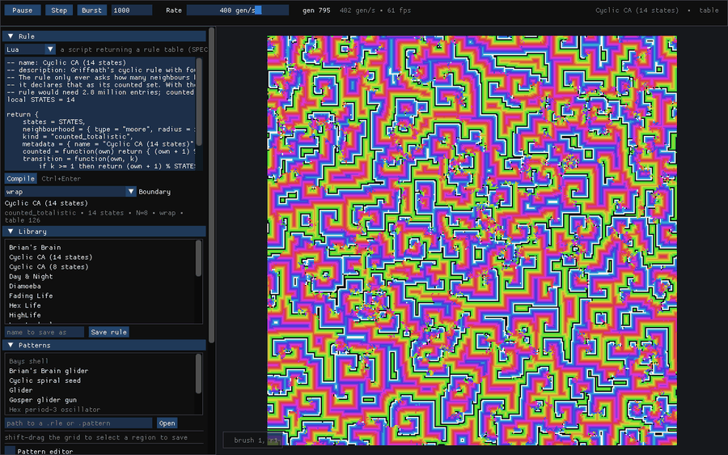
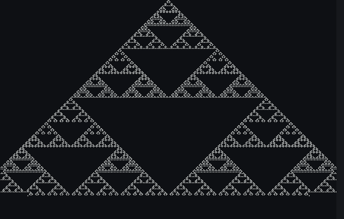
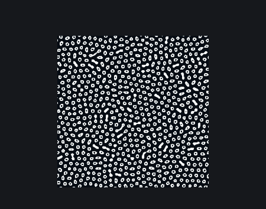
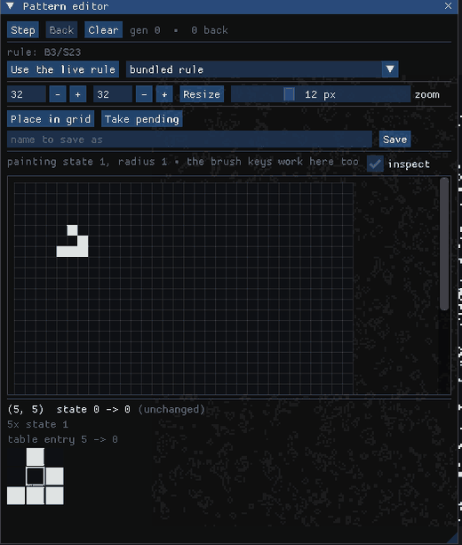
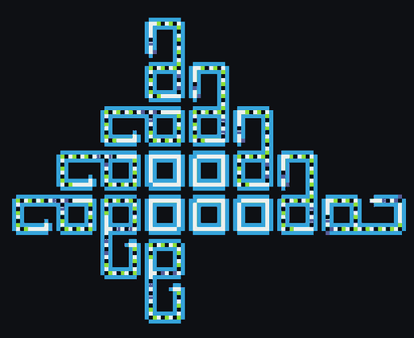

> **Status:** Current for 2026-09-23
> **Audience:** people using Aether — running it, authoring rules, recording what it does. No prior cellular-automata background assumed; no C++ needed.
> **See also:** [README](README.md) for the short version, [BUILD.md](BUILD.md) for prerequisites, [SPEC.md](SPEC.md) when you need the exact rules rather than the working ones.

# The Aether manual

Aether runs cellular automata on a GPU. One engine covers one, two and three dimensions, square and hexagonal lattices, discrete states and continuous values; rules are written in a small notation or in Lua; and every run can be saved and replayed to the identical cell.

This manual is in three parts. **Getting started** is enough to see something moving. **The window** walks through each section of the interface. **Working with it** covers the things you would come back for — authoring rules, recording films, reproducing a run. The [worked examples](#worked-examples) near the end are all verified: every command shown has been run.

---

## Contents

- [Getting started](#getting-started)
- [The window](#the-window)
  - [Rule](#rule) · [Library](#library) · [Patterns](#patterns) · [Grid](#grid) · [Brush](#brush)
  - [Mutation](#mutation) · [Lineage](#lineage) · [Palette](#palette) · [Export](#export) · [Session](#session) · [Engine](#engine)
- [Writing rules](#writing-rules)
- [Dimensions and lattices](#dimensions-and-lattices)
- [Continuous automata](#continuous-automata)
- [The resource](#the-resource)
- [Genomes](#genomes)
- [The pattern editor](#the-pattern-editor)
- [Reproducibility](#reproducibility)
- [Running without a window](#running-without-a-window)
- [Screensaver](#screensaver)
- [Worked examples](#worked-examples)
- [Reference](#reference)

---

## Getting started

```bash
cmake -B build -DCMAKE_BUILD_TYPE=Release
cmake --build build -j
./build/aether --gl-check     # exit 0 means the compute path works here
./build/aether
```

`--gl-check` is worth running first. Aether needs OpenGL 4.3 compute shaders and has no fallback renderer, so if this fails nothing else will work; [BUILD.md](BUILD.md) explains what to install.

Start with something recognisable:

```bash
./build/aether --rule B3/S23 --size 512x512
```

Conway's Life on a 512×512 grid, seeded at random. Press `Space` to pause, `N` to take one generation, `R` to reseed, `C` to clear. Drag with the left button to draw, the right button to pan, and the wheel to zoom.

**On a laptop with two GPUs**, Aether will use the integrated one unless told otherwise. On an Optimus machine:

```bash
__NV_PRIME_RENDER_OFFLOAD=1 __GLX_VENDOR_LIBRARY_NAME=nvidia ./build/aether
```

---

## The window



Three regions: a **transport bar** across the top, a **panel column** down the left, and the **viewport** filling the rest.

The transport bar holds play/pause, single step, burst, the rate slider, and readouts for the generation, the achieved generations per second and the frame rate. It never scrolls away. At the right it names the running rule and which backend is executing it.

The **rate** steps a 1-2-5 ladder — 1, 2, 5, 10, 20, 50 and so on — rather than sliding continuously, so a drag always lands on a round number. `,` and `.` move one stop slower or faster, which is usually quicker than reaching for the slider. The label shows the rate actually in force, which is not always a ladder value: a rate given with `--rate` or restored from a session keeps exactly what it was set to until you move the control.

Rate is a target, not a promise. When the machine cannot keep up the bar says **below target** and the step cap has been reduced to keep the window responsive; nothing about the automaton changes, only how often it is stepped.

The left column is a stack of collapsing sections, ordered roughly by when you need them. Each is described below; the **Keys** section at the bottom lists every shortcut, and `F1` or `?` opens it.

### Rule

Type a rule and compile it with `Ctrl+Enter`. The dropdown chooses between the **DSL** — Aether's own notation — and **Lua**. Below the text box, the boundary selector decides what a cell at the edge sees:

| Boundary | A neighbour off the edge |
|---|---|
| `wrap` | comes from the opposite edge (a torus) |
| `zero` | reads as state 0 |
| `mirror` | is the grid reflected about its edge cell |

Under that, a summary line tells you what the rule actually compiled to: its kind, state count, neighbour count, boundary, and whether it became a lookup table or generated GPU code. That line is the quickest way to see whether the rule you wrote is the rule you meant.

### Library

Nineteen bundled rules, each with a description. Click one to load it. If it is a different number of dimensions from the current grid, the grid is rebuilt to suit — loading a 3D rule gives you a 3D grid.

Rules you write can be saved back into `rules/` with a name, and appear here next time.

### Patterns

Nine bundled patterns — gliders, a Gosper gun, a Wireworld loop, Langton's loop and others — plus a box to open any `.rle` or `.pattern` file.

Click a pattern and it follows the cursor, **drawn in the colours it will become** rather than written into the grid, so you can see it against what is already there. Click the viewport to commit it; `Esc` cancels. A pattern the running rule cannot take is greyed in the list and tinted red under the cursor, and the panel says why — usually the wrong lattice, or more states than the rule has.

Shift-drag the viewport to select a region, and the panel will write it back out as a file. The format follows the pattern rather than your file name: Golly's extended RLE where RLE reaches, and a native `.pattern` where it does not — hexagonal, 3D and continuous patterns all need the latter.

**In a volume** the panel works the same way with one extra step: press `S` for slice mode first, because a click in a 3D view has no single cell behind it — a ray crosses the whole grid. The pattern is placed on the slice you are painting on, centred on the cursor within it, with its own depth running away from you along the slice axis. A flat pattern is one cell deep and so lands exactly on the slice you can see. Instead of the coloured preview you get a wireframe box, which is what tells you the size and position; the colours would need a second volume render for a pattern that exists until the next click.

Selecting a region is 2D only. A rectangle dragged across a volume names everything behind it rather than a region, so there is no sensible reading of the gesture.

### Grid

Size fields and a **New grid** button; then the actions, then the densities.

- **Seed** fills the whole grid at the density weights below. **Clear** empties it. **Fit** puts the whole grid in view at a whole number of pixels per cell; **Fill view** uses the whole viewport at a fractional zoom instead.
- **Seed region** fills only the shift-dragged selection, leaving the rest alone. In 3D this becomes **Seed slice** and fills the slice the brush is painting on. In 1D it becomes **Single cell**, which is how an elementary rule is usually started.
- **Random fill density** is folded away because it is set once and left. One slider per state; state 0 takes whatever is left over.

### Brush

Radius and state for drawing. `0`–`9` pick the state directly and `[` / `]` change the radius; the viewport overlay shows both. On a hexagonal lattice the brush is a hexagon, not a disc.

### Mutation

Two independent controls that let a run drift:

- **Cell mutation** replaces a cell's new state with a random one, with probability *p* per cell per generation. Optionally grouped into blocks of 2^k cells, so the noise arrives in clumps rather than as uniform speckle.
- **Rule mutation** makes small edits to the rule itself every *N* generations — one table entry changed, or one literal in an expression nudged. The rule stays valid; it just stops being the rule you typed.

Both draw from seeded streams, so a run with mutation on is exactly as reproducible as one without.

### Resource

Only appears for a rule that declares one, since every control in it would otherwise be a slider that does nothing. `rules/grazing.lua` is the bundled example.

The panel leads with the **seed**, because a resource nobody has seeded is zero everywhere and the sliders below it then do nothing visible — it says so in orange until you press the button. *patches* is how many regions of fertility lie across the grid, *detail* how much finer texture sits inside them, and *poorest*/*richest* the range they span. **Seed the world** draws a fresh capacity landscape and fills the resource to it. The draw comes from stream A, so it is part of the session and replays.

Then the controls, which are run-time and cost nothing to move — no recompile, no lineage entry:

- **regrowth** is the harshness of the world and the one to reach for first. It is the fraction of the gap to capacity closed each generation: 0 never recovers what is taken, 0.5 recovers almost at once. On `grazing` at 96×96 it takes the population from 22% of the grid to 89%.
- **trickle** is a constant addition proportional to capacity, whatever the current level. It is the damping: it lets a patch scoured to nothing come back, so a low regrowth makes a poor world rather than a permanently dead one.
- **spread** is exchange with the neighbours, so a rich patch bleeds into a poor one. It conserves under a wrap boundary; under zero the edge loses material, which is a world with an edge behaving like one. Under a **mirror** boundary it is disabled and says so — an edge cell counts its inward neighbour twice while that neighbour counts it once, so spreading there would create material rather than move it.

### Lineage

Every rule the run has passed through, with the generation at which it took effect. Mutation can produce something better than what you started with, and this is what stops it being lost. Any entry can be **pinned** — named and saved into the rule library — or **rewound** to, either the rule alone or the grid with it.

### Palette

Colour per state. A rule can carry its own palette, and most bundled ones do. **Age shading** darkens an ageing tail so a fading cell reads as fading.

### Export

**PNG** writes the viewport as it stands — the automaton, without the panels over it. Below that, a folder, a generation range and a step record a numbered sequence for something else to encode into a film.

A sequence is counted in **generations**, not frames. While one is recording, the transport stops deciding how far to step, so a frame that takes longer than usual cannot drop or double a generation. The result is a record of the run rather than of how fast your machine was drawing.

### Session

Save and load `.aether` files. A saved run replays bit-for-bit from its initial state — see [Reproducibility](#reproducibility). **Verify replay** checks it on the other execution path and tells you whether the two agree.

### Engine

Which path is executing: **GPU** for the compute shader, **CPU** for the reference implementation. The CPU path is the oracle the GPU path is tested against — identical results, far slower. Switch to it when you want to be sure, not when you want speed.

---

## Writing rules

Four notations, all in the same text box. Aether works out which you have written.

### Life-like: `B3/S23`

Birth and survival counts. A dead cell with exactly 3 live neighbours is born; a live cell with 2 or 3 survives; everything else dies.

```
B3/S23        Conway's Life
B36/S23       HighLife — the same, plus replicators
B2/S          Seeds
B3678/S34678  Day & Night
```

### Generations: `B2/S/C3`

The same, plus an ageing tail of *C* states. A cell that dies does not vanish; it advances through the remaining states and then goes. Brian's Brain is `B2/S/C3` — born on two neighbours, never surviving, with one dying state in between.

### Table blocks

When counts are not enough, write the transitions out. This is Wireworld:

```
states 4;
neighbourhood moore 1;
1: n(0) >= 0 -> 2;                # a head becomes a tail
2: n(0) >= 0 -> 3;                # a tail becomes wire again
3: n(1) == 1 or n(1) == 2 -> 1;   # wire ignites beside one or two heads
```

`n(s)` is the number of neighbours in state *s*. Statements are tried in order and the first match wins; **a cell matching nothing keeps its state**, which is why the rule above needs no line saying so. `#` starts a comment.

`neighbourhood` takes `moore`, `von_neumann` or `hex` and a radius.

### Signature literals

For rules that depend on *which* neighbour is in which state rather than on counts, give the neighbourhood exactly:

```
0: [1, 0, 0, 0] rot -> 1;
```

The list is the neighbours in canonical order, `_` matches anything, and `rot` expands the pattern to its rotations — a quarter turn on a square lattice, a sixth on a hexagon. That is how rotationally symmetric tables are published, and it is what makes Langton's loops writable: 219 lines of it, in `rules/langtons-loops.rule`.

### Ageing tails: `decay`

```
states 2;
neighbourhood moore 1;
decay 6;
0: n(1) == 3 -> 1;
1: n(1) < 2 or n(1) > 3 -> 0;
```

Conway's Life where a dying cell takes six generations to fade. `decay` is not a new concept — it rewrites into ordinary extra states before anything else sees it.

### Deadlines: `lifespan`

`decay` gives a dying cell somewhere to fade to. `lifespan` is its mirror: a cell is born at age 1, advances one age for every generation it survives, and at age *L* **dies regardless of its neighbours**.

```
states 2;
neighbourhood moore 1;
lifespan 8;
0: n(1) == 2 -> 1;
1: n(1) < 2 or n(1) > 3 -> 0;
```

That clause — regardless of its neighbours — is the whole feature. A deadline a supportive neighbourhood could override would just be a slower `decay`.

Three things to know before you write one.

**It needs the statement form.** B/S notation has no statement list to hang a lifespan on, and its `C` is a tail rather than a deadline, so `B2/S23 lifespan 8` is not something you can write. Use a table block, as above.

**Write the deaths, not the survivals.** A cell matching nothing keeps its state, which under a lifespan means *advances an age* — so a line saying a cell survives is a no-op, and a rule whose only survival line says `-> 1` never dies of anything except the deadline. This is easy to get wrong and impossible to notice from the outside: the rule parses, compiles, runs on both paths and gives you a lively grid.

**It needs a rule that reproduces.** Conway's Life does not: its long-term population is still lifes and oscillators, every one of which persists *without* reproducing, so a deadline kills them and nothing replaces them. Measured on 64², cells seeded at age 1, at generation 2000:

| base rule | on its own | with `lifespan 8` |
|---|---|---|
| `B3/S23` | 9.4% of the grid | **0.3%** |
| `B2/S23` | 35.5% | **34.5%** |

A rule that keeps making new cells barely notices a deadline. One that merely persists is gutted by it. That is the feature working, not failing.

`lifespan` and `decay` compose, in that order — ages, then a tail — and the result is refused rather than truncated if it would need more than 256 states or exceed the table threshold, with a message naming the longest that fits.

A fresh grid seeds a lifespan rule the way the table above was measured: every cell newly born at age 1, at the density the base rule's own band asks for. It does not spread cells across the ages, which would start a `lifespan 8` rule with 89% of the grid alive and kill it within fifty generations. You can still set the weights by hand in **Grid → Density** if you want a population that starts part-way through its life.

Nothing downstream learns a new concept here either: an age is an ordinary state. That is also why a per-cell deadline needs no feature of its own — a cell's age *is* its state index, so `age >= (genome & 7)` is an ordinary comparison over a genome, and fertility windows and juvenile periods are ordinary conditions over states.

### Lua

For rules that are easier computed than tabulated, switch the dropdown to Lua. A script runs **once, at compile time**, and returns a table describing the rule. It cannot run during the simulation and has no access to files, the network or the clock.

```lua
local STATES = 8
return {
    states = STATES,
    neighbourhood = { type = "moore", radius = 1 },
    kind = "counted_totalistic",
    counted = function(own) return { (own + 1) % STATES } end,
    transition = function(own, k)
        if k >= 1 then return (own + 1) % STATES end
        return own
    end,
}
```

That is the cyclic cellular automaton: each state is eaten by the next, and spirals form out of noise. `transition` is called once per table entry while the rule is built, so a rule with thousands of entries can be described in a few lines instead of listed.

[LUA.md](LUA.md) is the cookbook: every kind of transition, continuous rules, the sandbox and its budgets, the error messages, and recipes.

---

## Dimensions and lattices



**One dimension.** A row of cells has nothing to look at in its own geometry, so Aether draws its history instead: each generation becomes a raster row and time runs down the screen, scrolling once it fills. `W110` — or any number from 0 to 255 — loads one of Wolfram's elementary rules.

```bash
./build/aether --rule W30 --size 800     # one number means a 1D grid
```

A 1D run starts from a single live cell, which is how these are usually read. Over the diagram the wheel sets how many pixels each generation gets; there is nothing to paint, since a click would write into a row that has already scrolled past.

**Two dimensions** is the default, and the one everything else is easiest in.

**Three dimensions** comes from a depth: `--size 64x64x64`. The grid is drawn as a volume; right-drag orbits, the wheel zooms, `S` enters slice mode so you can draw on one plane at a time, and `-` / `=` move the slice. The View section has clip planes and opacity for seeing inside. Patterns can be placed on a slice too — see the Patterns section.

A warning worth having before you start: **a three-dimensional soup collapses.** Both bundled Bays rules lose around 99% of their cells in the first fifty to a hundred generations and then settle into a few dozen still lifes with an oscillator among them. This is the rules rather than a defect. Twenty-six neighbours spread the live count much wider than eight do, so against a survival band two counts wide almost every cell in a random fill is over- or under-populated. Bays' published results are all *designed* starts, which is what `patterns/bays-shell.pattern` is for: twelve cells that hold their shape indefinitely. Place it on an empty grid rather than seeding one.

The seeding density helps and does not cure it. A two-state rule is seeded so that the expected number of live neighbours lands in the middle of the counts it is alive on, so 4555 gets 0.17 rather than the 0.3 a 2D rule would want — which buys about thirty times as many cells at generation 50 and the same ending.

**Hexagonal lattices** come from the rule, not the grid: `neighbourhood hex 1` gives six neighbours. Storage is axial, so a W×H hex grid is a rhombus on screen rather than a rectangle, and wrapping is a rhombic torus. Hex neighbourhoods are two-dimensional only.

---

## Continuous automata

A cell can hold a value between 0 and 1 rather than a state index. Instead of counting neighbours, the rule convolves the neighbourhood with a **kernel** and passes the result to a **growth function** that says how much to add.



These are written in Lua, because the kernel is computed rather than listed. `rules/lenia.lua` is the worked example — a Gaussian shell and a polynomial growth band, which is the shape of a Lenia rule:

```bash
./build/aether --lua rules/lenia.lua --size 512x512
```

Two growth forms are available, `rectangular` and `polynomial`. A Gaussian is deliberately not among them: it needs `exp`, whose precision the graphics driver decides, and that would put the GPU out of step with the reference implementation.

---

## The resource

Most rules in this manual decide a cell's fate from its neighbours and nothing else. A **resource** rule decides it from a quantity the world holds: a scalar field per site that the engine refills and the rule draws down.

Two fields make one: the **resource** itself, and its per-site **carrying capacity** — the ceiling it regrows toward, which nothing but the seed ever writes. Both are `f32`. The rule reads either at its own site or at a neighbour's, and its write on the resource is the *draw-down* and nothing more. Regrowth, the trickle, spreading and the clamp are the engine's, applied in that order to whatever the rule left.

That division is deliberate and it is why the rates are sliders rather than numbers in the rule. A constant in a rule is part of the rule, so moving it would recompile and add a lineage entry — 64 ms a drag, and a lineage full of noise. And the ordering matters more than it looks: regrowth *after* consumption rather than before is the difference between a quantity that is conserved and one that leaks, and a leak in a quantity under selection does not sit quietly producing slightly wrong totals. Anything that exploits it outbreeds anything that does not, so the first symptom is a population thriving for no visible reason.

### Trying it

```bash
aether --rule @grazing --size 256x256
```

Open the **Resource** panel, press *Seed the world*, and press space. Plants fill the fertile ground and stay off the poor ground; the boundary between them is drawn by the noise rather than by the rule. Then drag **regrowth** and watch the population follow it.

Headlessly, the same thing, and this is how the figures in the rule's own header were measured:

```bash
aether headless --rule @grazing --size 96x96 --generations 800     --seed-resource 5:3:0.15:1.0 --resource 0.02:0.0005:0.15 --png out.png
```

`--seed-resource` is `patches:octaves:poorest:richest` and `--resource` is `regrowth:trickle:spread`. Without `--seed-resource` the world is empty and everything starves, which is the honest default: seeding draws from stream A, so doing it implicitly would consume draws you did not ask for.

### Why it settles, and what that tells you

`grazing` reaches a slowly-shifting boundary rather than running forever. That is not a tuning failure; it is what a plant layer does with nothing eating it. The rule's own header works the equilibrium out: a live cell holds its ground exactly where regrowth covers its appetite, at `soil − eat/regrowth`, so ground below a threshold cannot feed one at all. Crowded cells eat two and a half times as much, which is the only reason the boundary keeps moving at all — without that term the rule reaches a fixed point inside four hundred generations.

The interesting version of this wants something that eats the plants, and that is a later feature rather than a slider you are missing.

### The books

The resource is the first quantity in this engine that is meant to be *conserved*, so the engine counts what enters and leaves: regrowth in, consumption out, spreading moved, and whatever the clamp adjusted. The four add up to the change in the total exactly, which is what makes a leak findable rather than merely suspected — it localises to the step that opened it instead of showing up as a total that is slightly wrong.

That accounting earned its keep the day it was written: it caught the first version of spreading creating material out of nothing, by measuring its gradient against two different generations at once. Nothing about the code looked wrong. There is no readout for the books in the window yet; they are checked by the test suite.

## Genomes

The resource gives a cell something to compete *for*. A **genome** gives it something to compete *with*: every cell carries a word of bits, a newborn inherits them from its live neighbours, and the rule decides what they mean.

This is the third way variation gets into a run, and the only one that is selected rather than merely applied. Rule mutation searches rule space over time; cell mutation flips cells over space; both are things done *to* the grid. Inheritance is passed on, so a genome that produces more offspring becomes more common without anything deciding that it should.

### The division of labour

The engine carries the bits and never reads them. It knows how many bits there are and nothing else — not that bit 3 means "born on three neighbours", not that bits 9 to 17 are survival conditions. The *rule* decides all of that, and the arrangement is why a later feature can put more genes in the same field without the engine learning anything new.

A rule declares a `u32` field with **no write expression** and names it as the genome. No write is the point: the engine owns those bytes at a birth and carries them otherwise, so a cell cannot edit its own genome. A rule that could would be Lamarckian, and nothing it discovered would be inherited by anything.

Genomes are Lua-only — the DSL has no way to declare a field, deliberately, since its business is notation that exists in the literature.

### The controls

They live in **Mutation**, under the two mutation controls, and appear only for a rule that has a genome.

- **from** — how a newborn's bits come from its live neighbours. *majority* takes each bit as more than half the parents have it, with a tie leaving the bit clear. *random parent* copies one of them whole. *crossover* takes each bit from one of two, drawn per bit.
- **mutate bits** and **per bit** — the chance each bit flips at a birth. This is where variety comes from: with it off, a grid of one genome is one rule and stays it for ever.
- **clan** — births in one aligned block are mutated the same way, so a change arrives in a whole clan at once. The parent draws are never grouped; a block sharing one parent pick would make a clan's births identical rather than merely correlated.

Every draw comes from stream B, hashed on the cell's coordinate and the generation, so nothing is stored and a run replays bit-identically. The draws are salted apart — one per parent pick, one per bit — because a single hash reused would correlate the parent with the mutations and the mutations with each other.

In **Palette**, *Colour by genome* gives each live cell a hue from its genome instead of from its state, so a lineage is a patch of one colour and its spread is something you watch. It is 2D only, and the panel says so in a volume.

### Trying it

```bash
aether --rule @lineages --size 256x256
```

Every cell carries the Life-like rule it runs, as eighteen bits: nine birth conditions then nine survival conditions, which is that rule's convention and not the engine's. The grid starts with a genome of all zeros — a rule that never births and never survives — so everything you see was built by mutation and kept by selection.

Turn **Colour by genome** on, then turn the per-bit mutation up to around `1e-2` and let it run. Then turn it back down and watch which variant takes the grid.

Headlessly, which is how the figures in that rule's header were measured:

```bash
aether headless --rule @lineages --size 64x64 --seed 9 --generations 1500 --inherit crossover:0.002 --png out.png
```

`--inherit` is `scheme[:per-bit[:clan]]`, with the scheme `majority`, `parent` or `crossover`. At `0.0005` that run goes extinct — too little variety to find a rule that reproduces before the grid empties. At `0.002` it ends with 3964 of 4096 cells alive and 600 distinct genomes. At `0.01` the grid is full with 1372 of them.

### What is actually being selected for

Nothing in `lineages` costs anything to be alive: there is no resource to eat and no deadline. So the fittest genome is simply the one that fills the most space, and the commonest survivor is one with nearly every survival bit set — a grid of cells that never die. That is a correct outcome and a dull one.

Coupling a genome to the resource field, so that filling the grid starves it, is what would make the competition worth watching, and nothing prevents a rule declaring both. A deadline is the other half: see `lifespan` above.

Two structural things worth knowing. A **`B0` rule cannot work under a genome** — a cell with no live neighbours has no parent to inherit from, so it keeps a genome of zero and no birth bit is ever set. And inheritance runs *before* the transition, which has to be the case for a Life-like genome: what decides whether a dead cell is born is the genome it does not yet have. A prospective genome is derived, shown to the rule, and kept only if the cell is actually born.

## The pattern editor

Press `E`. A scratch pad with a grid and a rule of its own, floating over the running simulation so you can compare against it.

It steps forward **and back** — a small host-side grid can afford to remember where it has been, which the main grid cannot. Draw with the same brush the viewport uses, step to see what happens, and step back when it goes wrong. It adopts whatever rule is running, or any bundled one.

Nothing on the pad is part of the run: it is not saved with the session and does not disturb one. What leaves it is an ordinary pattern, either placed into the grid or written into `patterns/`.



**The inspector.** Tick *inspect* and hover a cell. Below the pad you get its state and the state it becomes, every neighbour drawn in the neighbourhood's own shape, the counts the rule actually asked about, and the table entry or condition that answered. Where a boundary sent a neighbour to the far side of the grid, or off it, the diagram says so — a cell on an edge behaves differently from one in the middle and it is rarely obvious how.

None of those figures is worked out for the display. They come from the same function the simulation steps with, so the explanation cannot drift from the behaviour.

---

## Reproducibility

Every run is reproducible from its saved session. That is not a convenience feature; it is the constraint the engine is built around.

All randomness comes from two named, seeded streams — one for the random fill and rule mutation, one for cell mutation — and nothing in the simulation reads the clock, the thread index or the system random device. A session records the initial cells, the rule, both seeds, and a journal of everything you did: every brush stroke, every reseed, every pattern placed, stamped with the generation it happened at.

So a session replays to the identical grid, on either execution path, in a different process, on a different machine:

```bash
aether headless --rule B3/S23 --size 256x256 --generations 100 --save run.aether
aether replay run.aether again.aether
aether compare run.aether again.aether
```

`compare` exits 0 and prints how many cells matched. **Verify replay** in the Session panel does the same thing from inside the window, on the other path.

This is also why rule mutation is safe to leave on. A run that drifts through rule space for ten thousand generations is still exactly recoverable.

---

## Running without a window

```
aether headless --generations G [--save F] [--png F] [--frame-dir D]
                [--frame-every N] [--frame-scale N]
aether replay IN OUT [--to G] [--cpu]
aether compare A B
```

`--rule @name` works here as it does in the window, so a scripted run can name a bundled rule rather than spelling it out — which matters for Langton's loops, whose 219 clauses are not something to paste onto a command line. The rule decides the dimensionality: `--rule @rule110 --size 512x512` gives a 1D grid of 512, and it says so rather than reshaping quietly.

`--png` writes the final grid; `--frame-dir` writes a numbered sequence, `--frame-every` generations apart, at `--frame-scale` pixels per cell. Images render through the same palette pass the window uses, so a headless frame and a screenshot of the same generation agree.

```bash
aether headless --rule B3/S23 --size 512x512 --generations 2000 \
       --frame-dir frames --frame-every 10 --png final.png
ffmpeg -framerate 30 -i frames/frame_%06d.png life.mp4
```

A headless image dump is 2D only: a picture of a volume needs a camera, clip planes and an opacity, which a flag list does not choose for you. The session and pattern formats carry 3D data losslessly for anything that wants it.

---

## Screensaver

```bash
./build/aether --screensaver --seconds 60
```

Fullscreen, no interface, walking the bundled rules and reseeding each, with some left to drift under mutation. Any key, any mouse button or a nudge of the mouse ends it.

The playlist is deterministic from the run's seed, and each entry prints the command that recreates it, so something worth keeping is not lost when the playlist moves on:

```
aether: Conway's Life  --rule @life --seed 13180641628780542681 --seed-b 13327142696364827322 --rule-mutation 371:1
```

---

## Worked examples

Every command below has been run.

### A glider crossing a grid

```bash
./build/aether --rule B3/S23 --size 128x128 --rate 10
```

Open **Patterns**, click *Glider*, and click near the top left of the viewport. It moves one cell diagonally every four generations. Watch the generation counter in the transport bar to check that for yourself.

### Wireworld: electrons round a loop

```bash
./build/aether --rule @wireworld --size 64x64 --rate 8
```

Open **Patterns** and place *Wireworld loop*. One electron circulates round a ring of conductor for ever, with a period of twelve generations. Its corners are chamfered deliberately: a square corner gives a cell three wire neighbours, the head ignites two of them, and the electron splits. Wireworld is the clearest demonstration of why counts are not always enough: the rule asks how many neighbouring cells are electron heads, and everything else follows.

### Brian's Brain, from noise to gliders

```bash
./build/aether --rule B2/S/C3 --size 256x256
```

A generations rule with one dying state. From a random soup it settles into a field of gliders within a few hundred generations. Turn on **Age shading** in the Palette section to see the dying cells as dying.

### Rule 30, and why it was used for random numbers

```bash
./build/aether --rule W30 --size 800
```

One live cell. The left half of the triangle is regular, the right half is not, and the centre column passed statistical randomness tests well enough that Mathematica used it. Compare with `W90`, whose exclusive-or draws Sierpinski's triangle, and `W110`, which is Turing-complete.

### Langton's loops reproducing

```bash
./build/aether --rule @langtons-loops --size 200x200 --rate 30
```



Open **Patterns**, place *Langton's loop*, and let it run. The loop extrudes an arm, grows it, turns it four times and closes it into a daughter; the first is complete at about generation 150. By generation 500 there is a colony, with the interior loops walled in by their own children and dying.

This is 1984's answer to von Neumann's question of whether a machine can build a copy of itself, in eight states and 219 transitions.

### Lenia: a continuous automaton

```bash
./build/aether --lua rules/lenia.lua --size 512x512
```

No states, no counting — a kernel convolved over the neighbourhood and a growth band. It holds a self-organised field indefinitely rather than settling or dying.

### 3D Life

```bash
./build/aether --rule @life-3d-4555 --size 64x64x64
```

Bays' first three-dimensional Life. Right-drag to orbit. Use the View section's clip planes to cut into the volume, and `S` then `-` / `=` to draw on one slice at a time.

Watch what the soup does: about 99% of it is gone by generation 100, leaving a few dozen cells of which some are a period-4 oscillator. That is the rule, not a fault — see **Dimensions and lattices** above. For what the rule is actually for, clear the grid with `C`, press `S` for slice mode, then pick **Bays shell** from the Patterns panel and click a slice. Twelve cells that hold their shape for as long as you care to run them.

### A run that drifts, and getting back what it found

```bash
./build/aether --rule B3/S23 --rule-mutation 250:1 --cell-mutation 0.0001
```

Every 250 generations, one edit to the rule. Watch the Lineage section fill. When something interesting appears, pin it — it is saved into the library under the name you give — or rewind to it, with or without the grid it had.

### Recording a film

```bash
./build/aether headless --rule B2/S/C3 --size 400x400 --generations 1200 \
       --frame-dir bb --frame-every 4 --frame-scale 2
ffmpeg -framerate 30 -i bb/frame_%06d.png brains.mp4
```

300 frames, four generations apart, at two pixels per cell.

### Proving a run reproduces

```bash
aether headless --rule B3/S23 --size 128x96 --seed 5 --seed-b 6 \
       --rule-mutation 100:1 --cell-mutation 0.001 \
       --generations 5000 --save a.aether
aether replay a.aether b.aether        # GPU
aether replay a.aether c.aether --cpu  # CPU reference
aether compare a.aether b.aether
aether compare a.aether c.aether
```

Five thousand generations with both mutations running, replayed from the initial state on each path and compared. This is in the test suite for exactly that reason.

---

## Reference

### Keys

| | |
|---|---|
| `Space` | pause or resume |
| `N` | one generation |
| `,` / `.` | slower / faster, one stop |
| `R` / `C` | random fill / clear |
| `F` | fit the grid to the view |
| `0`–`9` | choose the brush state |
| `[` / `]` | brush radius |
| `Ctrl+Enter` | compile the rule |
| `E` | the pattern editor's scratch pad |
| `F1` or `?` | the key list |
| Left drag | paint |
| Shift+drag | select a region |
| Left click | place a pending pattern |
| `Esc` | cancel a pending pattern |
| Right drag | pan (2D) or orbit (3D) |
| Wheel | zoom |
| `S` | 3D: slice mode |
| `-` / `=` | 3D: move the slice |

### Command line

| Option | |
|---|---|
| `--rule R` | B/S, B/S/C, `W<n>`, or a table block; `@name` loads from the library |
| `--lua FILE` | a Lua script returning a rule table |
| `--size W[xH[xD]]` | one number is 1D, two 2D, three 3D |
| `--cpu` | start on the CPU reference path |
| `--seed N` / `--seed-b N` | stream A and stream B seeds |
| `--rate G` | target generations per second |
| `--rule-mutation N[:M]` | mutate every N generations with M edits |
| `--cell-mutation P[:K]` | probability P, optionally in blocks of 2^K |
| `--load FILE` | resume a saved session |
| `--pattern FILE` | open a pattern, ready to place |
| `--screensaver` / `--seconds N` | fullscreen playlist |
| `--gl-check` | verify the compute path and exit |
| `--frames N` / `--screenshot F` | for scripted runs |

### Files

| | |
|---|---|
| `rules/*.rule` | a rule in the DSL, with a `# name:` and `# description:` header |
| `rules/*.lua` | a rule in Lua, same header with `--` |
| `patterns/*.rle` | Golly extended RLE: 2D, square, u8 |
| `patterns/*.pattern` | native JSON: hexagonal, 3D, any state count, float cells |
| `*.aether` | a session: initial cells, rule, seeds, journal, lineage |

Rules and patterns are searched for in `$AETHER_RULES` / `$AETHER_PATTERNS`, then `./rules` and `./patterns`, then beside the executable.

### Where to look next

- [LUA.md](LUA.md) — writing rules in Lua in detail, with worked examples
- [SPEC.md](SPEC.md) — the exact grammar, the table layouts, the mutation semantics, the session format
- [ARCHITECTURE.md](ARCHITECTURE.md) — how the modules fit together
- [DECISIONS.md](DECISIONS.md) — why it is built this way, and what would change each choice
- [FEATURES.md](FEATURES.md) — what exists, what does not, and what was deliberately left out
