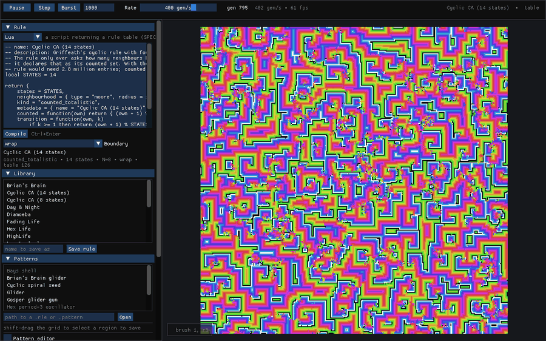
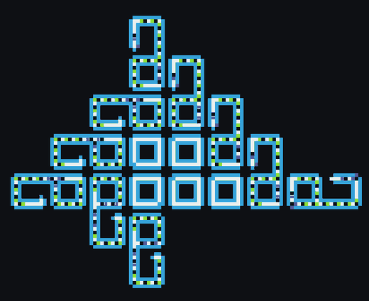
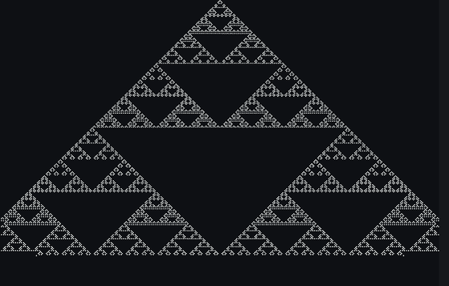
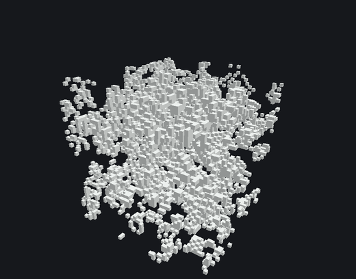
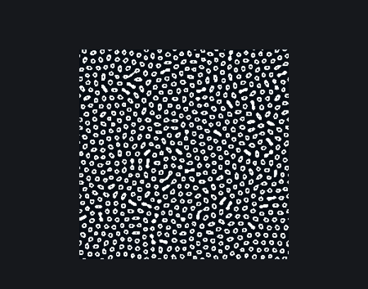
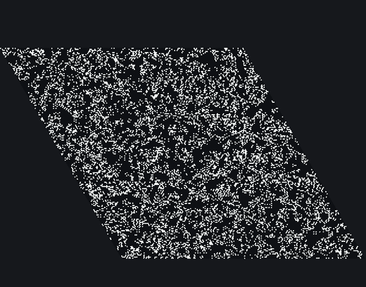

> **Status:** Active
> **Provenance:** Shane Hartley (author); Claude (documentation scaffold, 2026-08-30)
> **Last reviewed:** 2026-09-26
> **Why this status:** Phases 1–6 complete — the 2D and 3D discrete core, hex lattices, mutation, lineage, sessions, Lua, codegen, continuous states, and the presentation work of Phase 6. Released as 0.1.0 on 2026-09-26. Phase 7 (ecosystem) is next and not started.

# Aether

Aether is a cellular automata laboratory for Linux. It runs discrete and continuous automata on 1D, 2D and 3D square lattices and 2D hexagonal ones from a single GPU-resident engine, with rules authored either in a compact declarative notation or in Lua, and with two independent stochastic controls — rule mutation and cell mutation — that let a run drift through rule space while it evolves. Every run is reproducible from a serialised session: initial state, rule, seeds, mutation schedule.

The name was confirmed on 2026-09-11 (see D-009).




## Quick start

```bash
git clone https://github.com/Darian-Frey/Aether.git
cd Aether
cmake -B build -DCMAKE_BUILD_TYPE=Release
cmake --build build -j
./build/aether --gl-check                   # exit 0 means compute shaders work here
./build/aether --rule B3/S23 --size 512x512
./build/aether --rule B5/S45 --size 128x128x128   # a depth makes it 3D
```

### In the window

Pause, step, burst and the rate live in the bar across the top, with the generation count and the running rule beside them. The left column holds everything else in sections, closed until you want them; **Keys** lists the shortcuts, and F1 opens it.

| | |
|---|---|
| Left drag | Paint with the brush (in 3D, on the current slice) |
| Right drag | Pan in 2D, orbit in 3D |
| Wheel | Zoom |
| Space · N | Pause · single step |
| R · C · F | Random fill · clear · fit the view |
| `[` `]` · 0–9 | Brush radius · brush state |
| S · `,` `.` | 3D: slice mode · move the slice |

### Rules

Type a rule into the Rule panel and compile it with Ctrl+Enter. Four notations:

```
B3/S23                              Life-like
B2/S/C3                             Generations
states 2; neighbourhood hex 1;      a table block: count conditions,
  0: n(1) == 2 -> 1;                signature literals like [1, _, 2, _] rot,
  1: n(1) < 3 or n(1) > 4 -> 0;     and decay N for an ageing tail
```

Or pick Lua in the same panel, or pass `--lua rule.lua`: a script runs once, at compile time, and returns a table describing the rule, computing the transition rather than tabulating it. The [Lua cookbook](LUA.md) covers that from Life to Lenia.

The Library section lists the bundled rules — Life, HighLife, Seeds, Day & Night, Diamoeba, Brian's Brain, Star Wars, Wireworld, a cyclic CA, a hexagonal Life, two of Bays' 3D rules, a fading Life, three of Wolfram's elementary rules and Langton's self-reproducing loops. `--rule @wireworld` loads one by name, and rules you write save back into `rules/`.

### One dimension

`W110` — or any number from 0 to 255 — loads one of Wolfram's elementary rules. A one-dimensional automaton has nothing to look at in its own geometry, so it is drawn as its history instead: each generation becomes a row and time runs down the screen, scrolling once the window is full. That is the picture rule 30 and rule 110 are known by, and it is what makes rule 90 recognisable as Sierpinski's triangle rather than a flickering line.

```bash
./build/aether --rule W30 --size 800     # one number is a 1D grid
```

A 1D run starts from a single live cell, which is how these rules are usually read; **Seed** in the Grid section gives a random row instead. Over the diagram the wheel sets how many pixels a generation gets.

### Patterns and seeding

The Patterns section lists what is in `patterns/` — gliders, a Gosper gun, a Wireworld loop, a Brian's Brain glider, a cyclic spiral seed, a hex oscillator, a 3D shell and the seed for Langton's loops — or opens any `.rle` or `.pattern` file. A chosen pattern follows the cursor until you click, drawn in the colours it will become rather than written into the grid, so you can see it against what is already there before committing to it; one the running rule cannot take is greyed in the list, tinted red under the cursor, and says why. Shift-drag the grid to select a region, and the Patterns section will write it back out as a file: Golly's extended RLE where RLE reaches, and a native `.pattern` where it does not, so hexagonal, 3D and continuous patterns are not squeezed into a format that cannot hold them.

The same selection is what **Seed region** fills, at the density weights in the Grid section and leaving everything outside it alone; **Seed** does the whole grid, and in 3D **Seed slice** does the one the brush is painting on. Every one of these is recorded, so a session replays a paste or a partial reseed exactly as it happened.

Press `E` for the pattern editor: a scratch pad with a grid and a rule of its own, drawn on a cell at a time with the same brush the grid uses. It steps forward **and back**, which the simulation cannot — a small host-side grid can afford to remember where it has been. It adopts whatever rule is running, or any bundled one, so a creature is watched under the rule it is being built for. Nothing on the pad is part of the run: it is not saved with the session and it does not disturb one. What leaves it is an ordinary pattern, either placed into the grid or written into `patterns/`.

Hovering a cell on the pad shows what it is about to do: its state and the state it becomes, every neighbour drawn in the neighbourhood's own shape, the counts the rule actually asked about, and the table entry or the condition that answered. Where a boundary sent a neighbour to the far side of the grid, or off it, the diagram says so, which is the part worth seeing — a cell on an edge behaves differently from one in the middle and it is rarely obvious how. None of these figures is worked out for the display: they come from the same function the simulation steps with, so the explanation cannot drift from the behaviour.

### Drift and reproducibility

The Mutation section has both controls: cell mutation as a probability per cell, optionally grouped into blocks so noise arrives in clumps, and rule mutation as point edits to the rule every N generations. Every rule a run passes through is in the Lineage list, where it can be pinned by name or rewound to — either the rule alone, or the grid with it. `--rule-mutation 250:1 --cell-mutation 0.0001` starts with both on.

The Export section writes what is in the viewport — the automaton, without the panels over it — as a PNG, or as a numbered sequence over a range of generations for `ffmpeg` or anything else to turn into a film. A sequence is counted in generations rather than in frames, so it is a record of the run and not of how fast this machine happened to be drawing.

The Session section saves and loads `.aether` files. A saved run replays bit-for-bit from its initial state: **Verify replay** checks it on the other execution path, and `aether replay in.aether out.aether` does the same headlessly.

The same pictures can be had with no window at all:

```bash
aether headless --rule B3/S23 --size 512x512 --generations 2000        --frame-dir frames --frame-every 10 --png final.png
ffmpeg -framerate 30 -i frames/frame_%06d.png life.mp4
```

Frames render through the same palette pass the window uses, at one pixel per cell unless `--frame-scale` says otherwise.

### Screensaver

```bash
./build/aether --screensaver --seconds 60
```

Fullscreen, no interface, walking the bundled rules and reseeding each, with some of them left to drift under rule or cell mutation. Any key, any button or a nudge of the mouse ends it. The playlist is deterministic from the run's seed, and each entry prints the command that recreates it, so something worth keeping is not lost when it moves on:

```
aether: Conway's Life  --rule @life --seed 13180641628780542681 --seed-b 13327142696364827322 --rule-mutation 371:1
```

It is a standalone fullscreen binary rather than an X screensaver hack: the `XSCREENSAVER_WINDOW` convention hands over a window to draw into, and raylib makes its own.

### A few of the things it runs

| | |
|---|---|
|  |  |
| **Langton's loops.** Eight states and 219 transitions; each loop extrudes an arm, turns it four times and closes it into a daughter. The interior loops die as their children wall them in. | **Rule 90, one dimension.** The left and right neighbours exclusive-ored. Each generation is a raster row and time runs down the screen, which is the only way a row of cells has anything to look at. |
|  |  |
| **Three dimensions.** Bays' 4555, raymarched as a volume with clip planes and slice painting. | **Lenia.** No states and no counting — a kernel convolved over the neighbourhood and a growth function. Cells hold a value rather than an index. |
|  | |
| **Hexagonal lattices.** Six neighbours, stored axially — which is why a W×H hex grid is a rhombus on screen and wraps as a rhombic torus. | |

See [BUILD.md](BUILD.md) for prerequisites and for running on the NVIDIA GPU on an Optimus laptop.

## Build requirements

| Requirement | Version | Notes |
|---|---|---|
| C++ compiler | C++20 | GCC 12+ or Clang 15+ |
| CMake | 3.20+ | |
| raylib | 6.0 | Fetched and built in-tree with the 4.3 rlgl backend |
| rlImGui + Dear ImGui | `Raylib_6_0` / 1.92.7 | Fetched and built in-tree |
| Lua | 5.4 | Rule scripting front end; taken from the system, not fetched |
| OpenGL | 4.3 core | Compute shaders are mandatory, not optional |

The OpenGL 4.3 requirement is load-bearing. Aether has no fallback renderer; see D-001. Full prerequisites and pins are in [BUILD.md](BUILD.md).

## Project structure

```
aether/
├── cmake/           Dependency fetch and build
├── src/
│   ├── core/        Grid, session, serialisation
│   ├── rule/        DSL parser, Lua front end, IR, compiler backends
│   ├── sim/         Scheduler, mutation engine, lineage log
│   ├── render/      2D and 3D presentation
│   ├── ui/          Control panel, drawing canvas
│   └── main.cpp
├── docs/images/     Screenshots used by the README and the manual
├── scripts/         benchmark.sh and the fixtures it measures with
├── shaders/         Compute and fragment shaders, plus codegen templates
├── rules/           Bundled rule library
├── patterns/        Bundled pattern library
├── tests/
└── docs/
```

## Documentation

- [Manual](MANUAL.md) — how it all works, with worked examples
- [Lua cookbook](LUA.md) — writing rules in Lua, from Life to Lenia
- [Features](FEATURES.md) — capabilities, priorities, acceptance criteria
- [Roadmap](ROADMAP.md) — phased plan
- [Architecture](ARCHITECTURE.md) — module boundaries and data flow
- [Decisions](DECISIONS.md) — design rationale and reversal conditions
- [Spec](SPEC.md) — rule IR, DSL grammar, mutation semantics, session format
- [Attack vectors](ATTACK_VECTORS.md) — failure modes and detection
- [Bugs](BUGS.md) — realised defects
- [Improvements](IMPROVEMENTS.md) — candidate refactors
- [Benchmarks](BENCHMARKS.md) — measured baselines against every performance target
- [Changelog](CHANGELOG.md) — version history
- [Claude handoff](CLAUDE.md) — AI session entry point
- [Build](BUILD.md) — prerequisites, dependency pins, GPU selection

## Licence

Apache-2.0. See [LICENSE](LICENSE).
